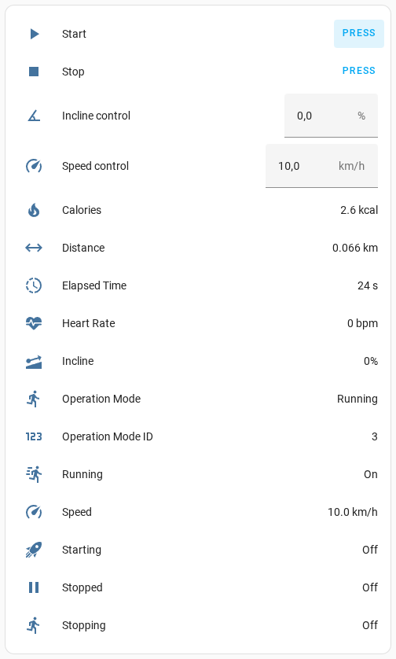

# esphome-treadmill-f15


[](https://www.buymeacoffee.com/syssi)

ESPHome component to monitor and control a Sportstech Treadmill F15 via BLE



## Supported devices

* Sportstech Treadmill F15
* Sportstech Treadmill F31

## Requirements

* [ESPHome 2024.6.0 or higher](https://github.com/esphome/esphome/releases).
* Generic ESP32 board

## Installation

You can install this component with [ESPHome external components feature](https://esphome.io/components/external_components.html) like this:
```yaml
external_components:
  - source: github://syssi/esphome-treadmill-f15@main
```

or just use the `esp32-ble-example.yaml` as proof of concept:

```bash
# Install esphome
pip3 install esphome

# Clone this external component
git clone https://github.com/syssi/esphome-treadmill-f15.git
cd esphome-treadmill-f15

# Create a secrets.yaml containing some setup specific secrets
cat > secrets.yaml <<EOF
wifi_ssid: MY_WIFI_SSID
wifi_password: MY_WIFI_PASSWORD

mqtt_host: MY_MQTT_HOST
mqtt_username: MY_MQTT_USERNAME
mqtt_password: MY_MQTT_PASSWORD
EOF

# Validate the configuration, create a binary, upload it, and start logs
esphome run esp32-ble-example.yaml

```

## Example response all sensors enabled

```
[I][treadmill_f15:155]: Status frame received
[D][treadmill_f15:156]:   02.51.03.08.00.00.00.00.00.00.00.00.00.00.00.5A.03 (17)
[D][binary_sensor:026]: 'Starting': New state is OFF
[D][binary_sensor:026]: 'Running': New state is ON
[D][sensor:103]: 'Operation Mode ID': Sending state 3.00000  with 0 decimals of accuracy
[V][text_sensor:015]: 'Operation Mode': Received new state Running
[D][text_sensor:069]: 'Operation Mode': Sending state 'Running'
[VV][treadmill_f15:185]: Speed:        0.8 km/h
[D][sensor:103]: 'Speed': Sending state 0.80000 km/h with 1 decimals of accuracy
[VV][treadmill_f15:188]: Incline:      0 %
[D][sensor:103]: 'Incline': Sending state 0.00000 % with 0 decimals of accuracy
[VV][treadmill_f15:192]: Elapsed time: 0 s
[D][sensor:103]: 'Elapsed Time': Sending state 0.00000 s with 0 decimals of accuracy
[VV][treadmill_f15:197]: Distance:     0.000 km
[D][sensor:103]: 'Distance': Sending state 0.00000 km with 3 decimals of accuracy
[VV][treadmill_f15:201]: Calories:     0.0 cal
[D][sensor:103]: 'Calories': Sending state 0.00000 kcal with 1 decimals of accuracy
[VV][treadmill_f15:206]: Heart rate:   0 bpm
[D][sensor:103]: 'Heart Rate': Sending state 0.00000 bpm with 0 decimals of accuracy
```

## Protocol

See [docs/protocol.md](docs/protocol.md) for detailed protocol analysis and reverse engineering notes.

## Known issues

None.

## Debugging

If this component doesn't work out of the box for your device please update your configuration to enable the debug output of the BLE component and increase the log level to the see outgoing and incoming BLE traffic:

```yaml
logger:
  level: DEBUG
  logs:
    esp32_ble_client: INFO

treadmill_f15:
  - ble_client_id: client0
    id: treadmill0
    update_interval: 1s
```

## References

* https://github.com/tyge68/fitshow-treadmill/blob/master/src/services/BTService.js
